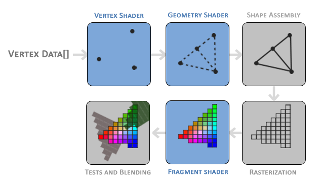

# Creating a Window

## Building GLFW
1. Install the GLFW source code from [their website](https://www.glfw.org/download.html), then unzip and add a `build/` directory
2. Open the CMake GUI (or CLI), and select the root directory of glfw as "source", and the `build/` directory as "build"
3. Click configure and select MinGW as your generator, with default makefiles
4. Click generate to create the makefiles
5. Navigate to your `build/` dir in a MinGW terminal, and run `mingw32-make`
6. Navigate to `build/src/` and copy your `libglfw3.a` file into your libraries path

## Setting up GLAD
1. Navigate to the [GLAD website](https://glad.dav1d.de/)
2. Select C/C++, OpenGL, and a modern version of OpenGL
3. Check the "Generate a Loader" option, and click generate
4. Download and extract the `.zip` the site generates, place the files under `src/` in your `src/` folder, and the subfolders under `include/` into your `include/` folder

## Compiling with G++
`g++ src/main.cpp src/glad.c -o main.exe -Iinclude -Llib -lglfw3 -lopengl32 -lgdi32`

# Hello Window

## Initializing and Killing GLFW
To initialize GLFW, a single function is used: `glfwInit()`
To kill GLFW, a single function is also used: `glfwTerminate()`

## Configuring a Window
In order to configure a window, the `glfwWindowHint()` function is used, with the arguments of `OPTION` and `VALUE`. The available arguments and values are found at [GLFW's window handling docs](http://www.glfw.org/docs/latest/window.html#window_hints). Here are the options and values used for this step of the project:
- `GLFW_CONTEXT_VERSION_MAJOR`: the major version for GLFW currently being used (`3` for this build)
- `GLFW_CONTEXT_VERSION_MINOR`: the minor version for GLFW currently being used (`3` for this build)
- `GLFW_OPENGL_PROFILE`: the profile (core [`GLFW_OPENGL_CORE_PROFILE`], compatibility [`GLFW_OPENGL_COMPAT_PROFILE`], or any [`GLFW_OPENGL_ANY_PROFILE`]) being used (`GLFW_OPENGL_CORE_PROFILE` for this build)

## Creating a Window Object
A specific object holds all "windowing" data and is referenced by other functions. It has the type `GLFWwindow` (typically a pointer) and is set by `glfwCreateWindow()` with the arguments `width`, `height`, `title`, `monitor`, `share`. Here are the options and values:
- `width`: width of the window in px (`800` for this build)
- `height`: height of the window in px (`600` for this build)
- `title`: name/title of the window (`"LearnOpenGL"` for this build)
- `monitor`: monitor to auto-fullscreen to (`nullptr` for this build, stays in windowed mode)
- `share`: window to share resources with (`nullptr` for this build, doesn't share resources)

## Calling Contexts
To give the window object to a thread, call `glfwMakeContextCurrent()` where the argument is a `GLFWwindow`

## Initializing GLAD
If GLAD can't load the address of OpenGL function pointers, we kill the program. To check address loading we cast `glfwGetProcAddress` to a `GLADloadproc`, then send it to `gladLoadGLLoader()`

## Creating Viewports
A viewport can be created using `glViewport()` with the arguments `x`, `y`, `width`, and `height`. We use a function provided by glfw (`glfwSetFramebufferSizeCallback()`) with the arguments `GLFWwindow` and `function`. Our function uses this to take in and dynamically change width and height alongside the window size. Here are the options and values:
- `x`: x-coordinate of viewport (`0` for this build)
- `y`: y-coordinate of viewport (`0` for this build)
- `width`: width in px of viewport (pass in `width` var from our window size for this build)
- `height`: height in px of viewport (pass in `height` var from our window size for this build)
- `window`: the window referenced by `glfwSetFramebufferSizeCallback()` (pass in `window` var from our inits for this build)
- `function`: a custom function that calls `glViewport()` (`framebuffer_size_callback()` for this build)

## Render Loops
### Ending a Loop
Creating a loop for rendering is simple in this context, we specifically use a `while()` loop, with the flag being `glfwWindowShouldClose()` with the argument `GLFWwindow`. This waits until the window is "instructed" to close (varies by system).

### Event Triggers
The `glfwPollEvents()` function (with no arguments), checks for any events that may occur (such as keyboard/mouse inputs) and updates window states (calling callbacks)

### Updating Graphics
The `glfwSwapBuffers()` function (with argument `GLFWwindow`) swaps the color buffers (a 2D buffer containing color values for each pixel in the window). Two buffers are rendered, the **front** buffer is used as an output image, while the **back** buffer has render commands called to it. This helps prevent screen tearing, artifacts, and flickering.

## Input Processing
To check inputs, we call a custom function `processInput()` passing in `GLFWwindow` that uses some built in functions from GLFW. `glfwGetKey()` has arguments `GLFWwindow` and `int GLFW_KEY_INPUT`. This outputs one of two variables (`GLFW_RELEASE` for when the button is *not* pressed, and `GLFW_PRESS` for when the key is pressed). For this program we use `GLFW_KEY_ESCAPE` which is assigned to keycode `256` in accordance to the US layout.

## Coloring
Rendering commands go between input processing and polling/graphics updates. Coloring the entire screen consists of setting a clear color with `glClearColor()` with the arguments `r`, `g`, `b`, and `alpha`. Then you clear the color buffer (`GL_COLOR_BUFFER_BIT`) filling it with our set color with the function `glClear()`, passing in `GL_COLOR_BUFFER_BIT`. Here are the arguments and descriptors:
- `r`: the red channel of standard RGB, set to floats (not hexidecimal) from `0.0f` to `1.0f`
- `g`: the green channel of standard RGB, set to floats (not hexidecimal) from `0.0f` to `1.0f`
- `b`: the blue channel of standard RGB, set to floats (not hexidecimal) from `0.0f` to `1.0f`
- `alpha`: the transparency channel of RGB-A, set to floats (not hexidecimal) from `0.0f` to `1.0f`

I've added a small function that randomly increases / decreases RGB values to display constantly updating colors.

# Hello Triangle
Everything in OpenGL is done in 3D space, but must be "flattened" to display on the 2D screen. This is managed by the **Graphics Pipeline** of OpenGL to make 3D coordinates into colored 2D pixels. Each little program running on your graphics card is called a **shader**, these can be modified from their original state by writing a `.GLSL` file (OpenGL Shading Language).



In OpenGL we must define at *least* a vertex and a fragment shader since they are not included on GPU firmware

## Vertex Input
Before we can draw anything, we need to define vertex data. This is stored in a **flat array** and not a nested array for GPU efficiency. Coordinates follow the format:
```cpp
float vertices[] = {
    x1, y1, z1,
    x2, y2, z2,//...
    xN, yN, zN
}
```
They are also normalized to fall under `[-1.0f, 1.0f]` and are later transformed into screen coordinates through the viewport.

## Initializing Buffers
The data stored is managed with a **vertex buffer object** or **VBO**. This is an OpenGL object, so it has an index, we can generate it using `glGenBuffers()` with the following arguments:
- `size`: amount of ID's to generate `GLsizei` (`1` for this build since we only have one vertex buffer)
- `buffers`: the buffers you want to generate indeces for in `GLuint*` (`&VBO` for this build [our vertex buffer])

## Binding Buffers
Binding buffers is done in the `glBindBuffer()` function, passing in:
- `target`: the target array to spit out to (`GL_ARRAY_BUFFER` for this build)
- `buffer`: the buffer to pass into the array (`VBO` for this build)

## Copying Data
To copy data to buffers, you call `glBufferData()` and pass in the data you want to send. Here are the arguments and what we used for this build:
- `mode`: specifies the target buffer to send data to (`GL_ARRAY_BUFFER` for this build)
- `size`: specifies the size of data to send in bytes (`sizeof(vertices)` for this build to get however many vertices we have listed)
- `data`: pointer to data to write (`vertices` for this build)
- `usage`: usage mode, with the most common being `GL_STATIC_DRAW`, `GL_DYNAMIC_DRAW`, & `GL_STREAM_DRAW` (`GL_STATIC_DRAW` for this build to draw once and be done)

## Shaders
Similarly programmed to C, we need a vertex shader and a fragment shader.

### Vertex Shaders
For a vertex shader, we need to be able to take in coordinates from a `vec3` (for 3-space coordinates shown in our `vertices[]`) and output a `vec4` (not 4-space, the 4th var in the vector is **perspective division** [covered in later chapters]). We *can* write shaders in our `main.cpp`, but why not load them from a `.GLSL` file? The vertex shader given by [LearnOpenGL](https://learnopengl.com/Getting-started/Hello-Triangle) is stored in `shaders/vertexShaderSource.GLSL`.

### Compiling Shaders
Using the `glCreateShader()` function to pass in the type of shader (i.e. `GL_VERTEX_SHADER`). Then call `glShaderSource()` with the arguments:
- `shader`: the shader to be replaced with the sourcecode (`vertexShader` for our vertex shader)
- `count`: the number of elements in the string array (for having more than one source compiled into one shader, `1` for this build)
- `string`: the source of the shader (`&vectorShaderSource` for our vector shader)
- `length`: an optional argument for specifying length of string elements (`nullptr` for this build)
Then we call `glCompileShader()` passing in the shader we want to compile.